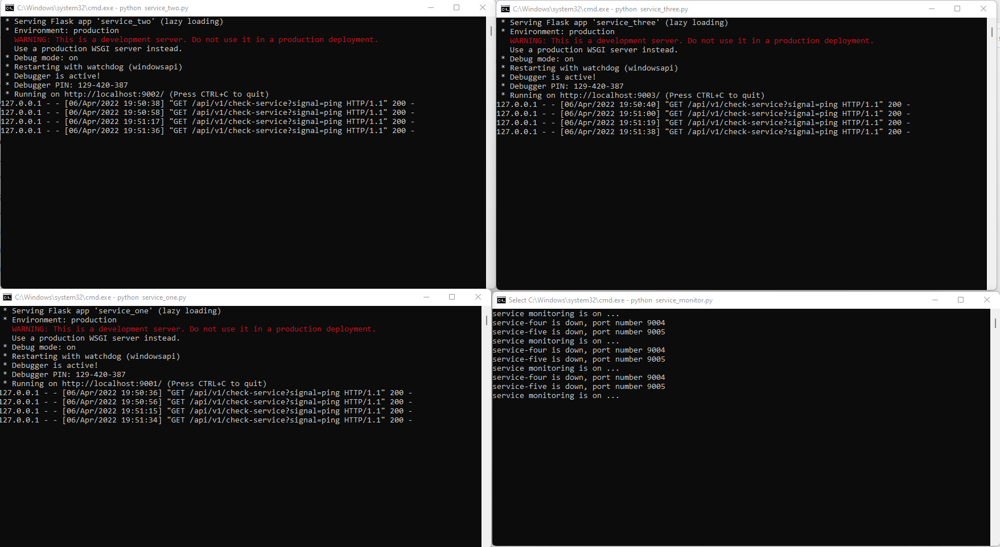

# Service Monitoring 

## About Project
Project demonstrating flask based services monitoring to check if the service is running or not. 

## How to use the code?
Install `benedict` package using `pip install python-benedict`

Clone code repository and execute `start.bat` file.

</img>

If you have any suggestion/request feel free to reach out to me via sending [email](bpst.work@gmail.com) or connect on [linkedin](https://www.linkedin.com/in/bpst/)

